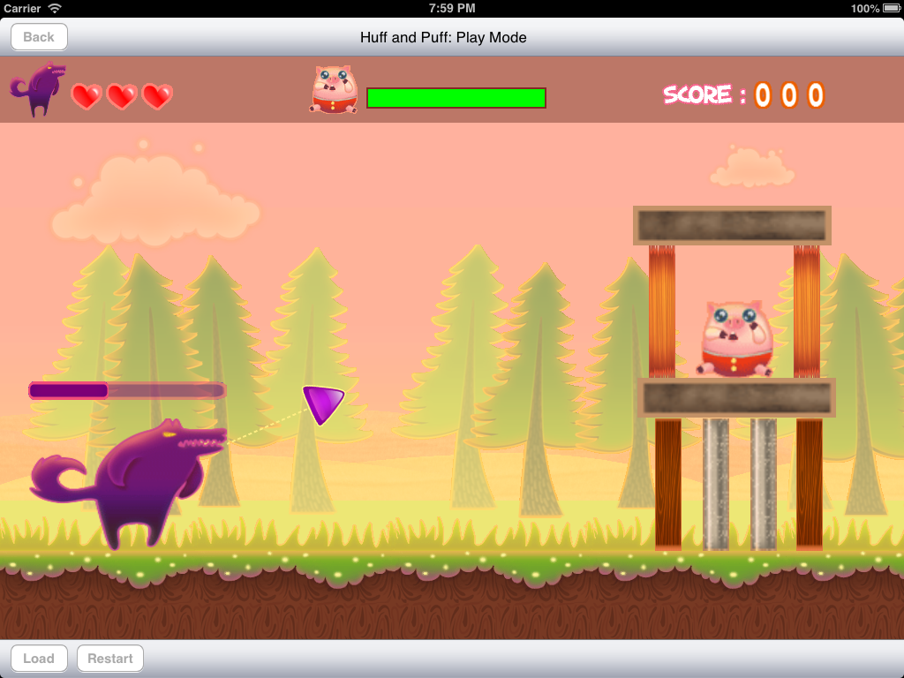

An Angry Birds clone App developed for for an individual assignment. **For iOS 5 and 6 only.**

The main objective of the game is to kill the pig. If the pig is killed before the wolf's lives run out, then the user wins. There are blocks in the way to stop the wolf's breath from reaching the pig. If the breath collides with a straw block, then the block is destroyed, while the breath's power is halved. For other blocks, the breath itself is destroyed but an impulse is imparted onto the blocks. 

* The game begins on the main screen, which has two buttons to allow the user to enter different modes: Design Mode and Play Mode
* In the Design Mode, the user can move objects from the palette on to the main game area. Only 1 wolf and pig can be added. However the user can add multiple blocks
 
 - The game objects can be moved around, zoomed in/out and rotated. Additionally, clicking on a block once will change its type. Finally, the objects can be double-tapped to move them back to the palette.
 - The user can click on the save button to save the current level. After entering the file name, the level will be saved.
 - On clicking the load button, a menu with all the saved files is displayed. The user can click on any file to load that level.
 - On clicking the reset button, all objects in the game area are moved back to the palette
 - On clicking the back button, the user can go back to the main menu

* In the Play Mode, the user is first asked to select the level which he wants to play.Once the user clicks the level name, all objects are loaded and the game starts.
 
 - On clicking the wolf once, a direction arrow and power bar appears. The user can rotate the arrow to set the desired angle of firing the breath. The power bar increases and decreases continously and stops when the user clicks on the wolf again.
 - On the second tap on the wolf, a new breath projectile is fired from the wolf's mouth. The projectile moves across the game area depending on the power and angle imparted, and it interacts with the various objects as described above.
 - Initially when no breath is fired, then the pig's health is not reduced by falling etc. Once the breath is fired, then any collision with the breath itself, or other blocks and walls reduces the pig's health.
 - The breath is destroyed if it collides with the pig or a block other than the straw block. If the breath is not destroyed within 5 seconds, then it self-destructs.
 - Once the pig dies, or the wolf runs out of breaths, the game is over. A message is displayed with the final score. 
 - At any time, the user can click on the Load button to load a new level to play.
 - the user can click on the restart buttton to restart the level.
 - The user can click on the back button to go back to the main screen.

